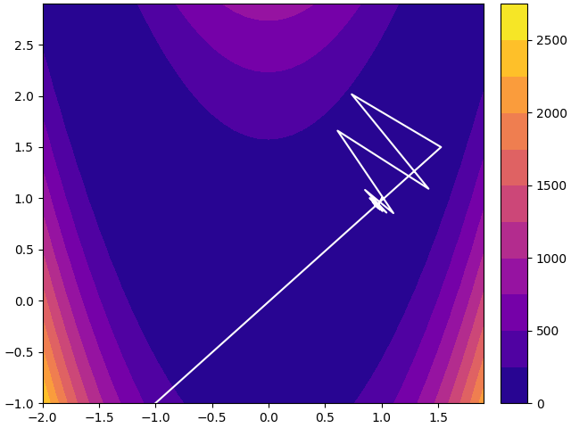

# Optimization Exercises
This repo is my solutions for course "Numerical Optimization in Robotics" on Shenlanxueyuan("Deep Blue Academy"? not sure about the official English name)[[link]](https://www.shenlanxueyuan.com/)

## Dependecies
- cmake(minimal version: 3.12.0)
- Eigen3
- pybind11

## Exercise 1
Implementation inexact line search(Backtracking/Armigo line search) for [Rosenbrock function](https://en.wikipedia.org/wiki/Rosenbrock_function).


The program is meant to be compatible for N dimension vector, tested on 2- and 3-dimension, the 4-dimension test took to long time.

Result on 2D:
 
### Usage
- prebuilt
```bash
./bin/ex1
```
- build from source
```bash
# make the target
cmake -B build
cmake --build build
# run the program
./build/ex1
```
### TODO
- [x] documentation
- [x] visualization
- [ ] add other methods like exact line search, diminishing step size